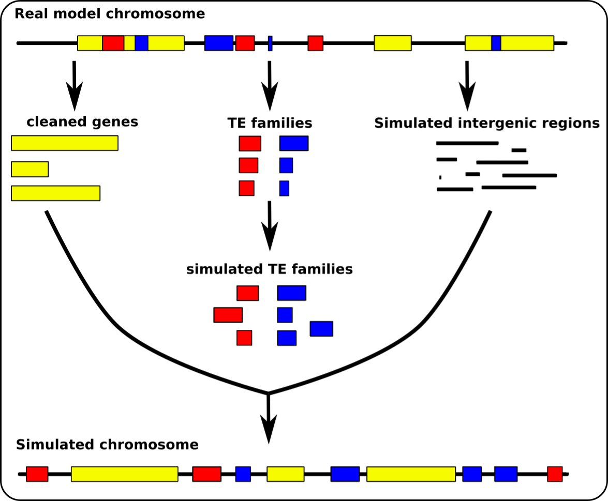

# replicaTE

## Introduction

**ReplicaTE** is a set of Python utilities which are designed to generate an artificial chromosome based on a real chromosome. The program recovers three components of interest (genes, transposable elements (TEs), and intergenic regions). Genes are cleaned up to remove any TEs inserted into them, and intergenic regions are simulated to avoid the presence of misannotated TEs. The sequences of the original TEs and all the characteristics of the families (number of copies, size of copies, divergence between copies, etc.) will enable new TE copies to be generated based on these characteristics. Next, the new TE copies are randomly placed in the chromosome.



## Dependencies

conda version 4.6.14 python = 3.7+

**Creating an environment from an environment.yml file**\
conda env create -f environment.yml

**To see all packages**\
conda list

**Activating an environment**\
conda activate TEsim\
-OR-\
source activate TEsim

**Deactivating an environment**\
conda deactivate

## Install note

All codes are in Python

___
## Running

### deleTE.py

This script allows to get the characteristics of specific elements (genes, intergenic regions, TEs) for the next steps and to generate a simulated chromosome without TEs. It takes as an input a genbank file from which it will extract the annotations. It outputs multiple files which can then be used as an input by the other scripts. The distributions used to simulate intergenic (and possibly gene) sequences are exponentiated Weibull for length and truncated normal law for GC content.

**Usage**
```sh
./python deleTE.py --gb <filename> [--sim] [--min <int>] [--dens <int>] [--gc <int>] [--TEs <filename>] [--out <string>]
```

Usage is reminded when typing:
```sh
./python deleTE.py -h, --help
```

*Mandatory options*
```sh
--gb <filename> Genbank_file
```

*All options*
```sh
--sim            | To simulate genes based on the gene models  
--min <int>      | Minimum lenth of intergenic regions (by default = 100 bp)  
--dens <int>     | Gene density (by default = gene density from the chromosome), it impacts the length distribution of the        intergenic regions  
--gc <int>       | GC content of the intergenic regions (by default = computed GC content from the real intergenic sequences)  
--TEs <filename> | To use a custom TE fasta file to retrieve their caracteristics for generaTE.py
--out <string>   | To set the output filename for the clean chromosome fasta file (by default = "output_clean_seq.fasta")
```

**Outputs**

In the *attachment* directory:

- Plots of observed and simulated distributions
- *gene_markedTEs_tab.tsv*, table of genes in which TEs are masked by ‘N’
- *ori_TEs_tab.tsv*, table of TEs retrieved from the annotation of the genbank file
- *output_clean_seq.fasta* (default name) contains the simulated chromosome without TEs

In the *data* directory: 

 - *stat_TEs_tab.tsv*, table of TEs used to generate simulated TEs (retrieved from the annotation or a TE fasta file), it will be used for the next step  
- *intergenic_sim_tab.tsv*, table of the simulated intergenic regions, it will be used for the next step
- *gene_clean_tab.tsv*, table of genes without TEs   

___
### generaTE.py

This script uses as inputs the files *stat_TEs_tab.tsv* and *intergenic_sim_tab.tsv* automatically. It generates TE copies based on the characteristics retrieved in the file *stat_TEs_tab.tsv* (copy number, length, Target Site Duplication (TSD), strand). Finally, an intergenic region is attributed for each copy to be inserted into using **inseraTE.py** (Nested TEs can be created if the option is specified).
The distributions used to simulate the TE copies are exponentiated Weibull for the number of copy, truncated Exponential for length and truncated Normal law for divergence. The TSD may have length between 0 and 8 bp, attributed for a given family when the option is specified.

**Usage**
```sh
./ python generaTE.py [--min <int>] [--nest] [--div <int>] [--cop <int>] [--pst <float>] [--tsd <float>] [--out <string>]
```

Usage is reminded when typing:
```sh
./python generaTE.py -h, --help
```

*Options*
```sh
--min <int>           | Minimum length of TE sequences (by default = 80 bp).
--nest                | Allow nested TEs 
--div <int>           | Mean divergence of TEs (by default = 20%).
--cop <int>           | Mean copy number of TE families (by default = same as the chromosome model).
--pst <float>         | Chance of TEs to be on forward strand (by default = 50%).
--tsd                 | Define TSD sequences
--out <string>        | Output filename of the TE fasta file (by default = "simulated_TEs.fasta").
```

**Outputs**

In the *attachment* directory:

Plots of observed and simulated distributions        

In the *data* directory:

- *simulated_TEs.fasta*, contains the sequences of the simulated TE copies        
- *param_TEs_tab.tsv*, input uses for *inseraTE.py* that contains all the characteristics of the simulated TEs   

___
### inseraTE.py

This script inserts TE copies randomly in the attributed intergenic region. The insertion can be ‘normal’ or ‘nested’ (inserted into a previous TE) and multiple nested events can arise. It uses as inputs *simulated_TEs.fasta*, *intergenic_sim_tab.tsv*, *gene_clean_tab.tsv* and *param_TEs_tab.tsv* (default names) and generates multiple outputs for description. The simulated chromosome is in fasta format. The script provides a deleted version of the simulated chromosome in which half of the TE copies are not present.

**Usage**
```sh
./ python inseraTE.py --TEs <filname> --int <filname> --gen <filname> --par <filname> [--ind <int>] [--out <string>]
```

Usage is reminded when typing:
```sh
./python inseraTE.py -h, --help
```

If all previous output names are the default ones, these options are not necessary.

*Mandatory options*
```sh
--TEs <filname>     fasta file of the TE simulated sequences (default = "simulated_TEs.fasta")
--int <filname>     table file of the characteristics of intergenic regions (default = "intergenic_sim_tab.tsv")
--gen <filname>     table file of gene informations (default = "gene_clean_tab.tsv")
--par <filname>     table file of TE parameters (default = "param_TEs_tab.tsv")
```

*Other options*
```sh
--ind <int>         To create n genomes with 1/2 inserted TEs (default = 1).
--out <string>      Output filename of the simulated chromosome fasta file (default = "simulated_genome").
```

**Outputs**

In the *data* directory:

- *intergenic_inser_tab.tsv*, table of intergenic regions of the simulated chromosome.
- *gene_inser_tab.tsv*, table of genes of the simulated chromosome.

In the *simulated_genome* directory:   

- *simulated_genome.fasta* (default name) contains the simulated chromosome sequence.
- *simulated_genome_masked.fasta* contains the masked simulated chromosome sequence. 
- *annot_TEs.tsv* contains inserted TE description.        
- *info_IR_insert_TEs.csv* contains information for each inserted intergenic regions.      

In the *deleted_genome* directory:    

- *simulated_genome_Del_1.fasta* contains the simulated deleted chromosome sequence. 
- *simulated_genome_Del_1_masked.fasta*, contains the masked simulated deleted chromosome sequence. 
- *annot_TEs_del_1.tsv* contains inserted TE description.   

___
## Other script

### variaTE.py
This script contains all methods used to simulate distributions and generate sequences.  

## Quick walkthrough
We will use the chromosome 2L of *Drosophila melanogaster* (version: NT_033779.5) as data.

**Installation**

In the *ReplicaTE* directory:
```sh
conda env create -f environment.yml
```

When the packages are installed, you need to activate the environment:
```sh
conda activate TEsim
```
-OR-
```sh
source activate TEsim
```

**Running**

- Decompress the test data
```sh
unzip ./test/chr2L_Dmel.zip
```
- Recovery of the needed elements
```sh
./python deleTE.py --gb ./test/chr2L_Dmel.gb
```
- Generate TE copies
```sh
./python generaTE.py
```
- Reconstruct the chromosome
```sh
./python inseraTE.py
```

___
## Correspondance

emmanuelle.lerat@univ-lyon1.fr

van.anthony.le@gmail.com

Emmanuelle Lerat, Van Anthony Le

___
## Citation

If using this tool, please cite
XXXX


31 December 2023

___
